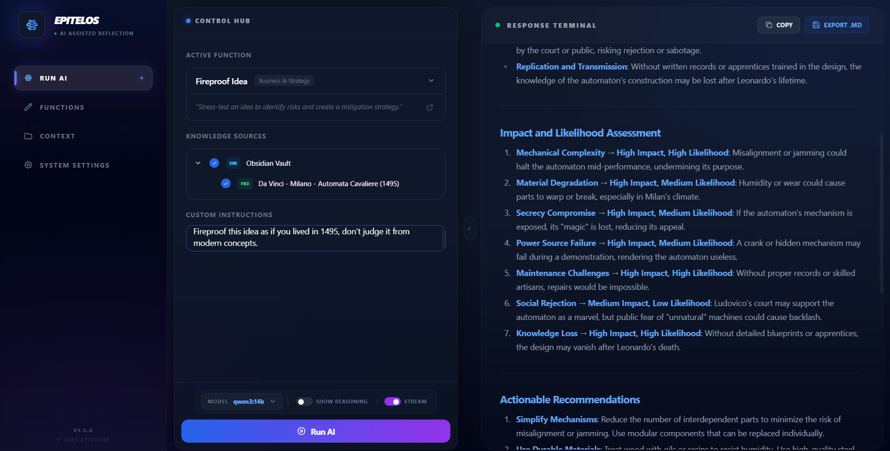
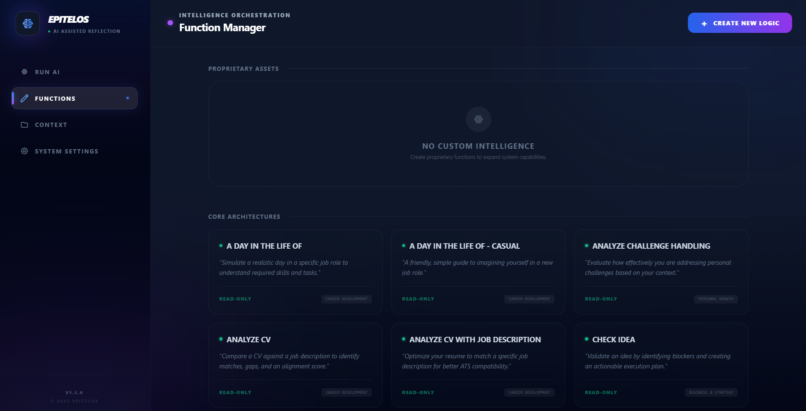
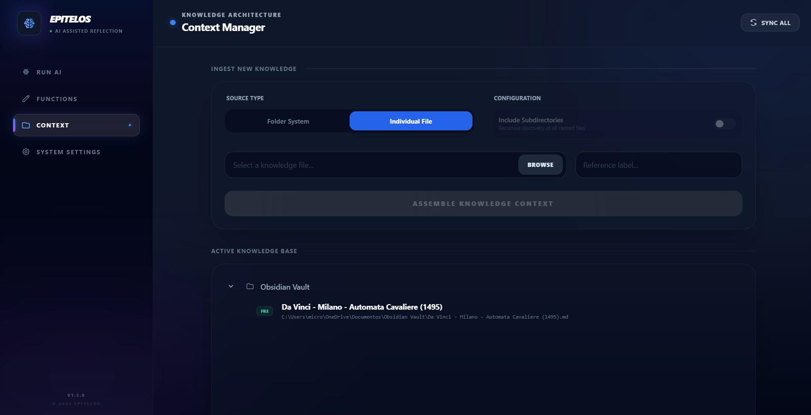
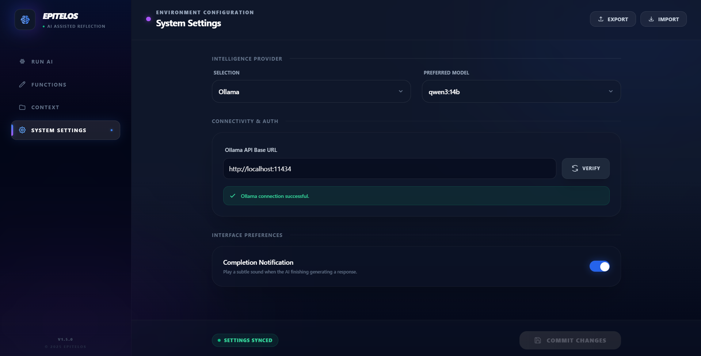

# EpiTelos - Personal Development AI

   

EpiTelos is a premium, high-fidelity AI orchestration platform designed for personal growth and self-reflection. It enables you to process your own life data—journals, notes, CVs, and project files—through a library of specialized "Intelligence Modules" while maintaining total privacy through local model support.

---

## 🧭 The Core Pillars

| Pillar | Description |
| :--- | :--- |
| **Clarity** | AI reveals patterns, contradictions, and insights hidden in your own words. |
| **Privacy First** | Hardware-encrypted OS Keychain storage for API keys and total local model support. |
| **Intelligence orchestration** | Specialized system prompts directed at specific growth outcomes (e.g., "Find Blindspots"). |
| **Contextual Awareness** | AI logic is fueled by your actual files, not generic training data. |

---

## Screenshots

| 

 |
| :--- |

|  |  |  |
| :---: | :---: | :---: |
| **Function Manager** | **Knowledge Context** | **Configuration** |

## 📖 Component Documentation

### 1. Run AI (The Workspace)
The **Run AI** view is your primary command center where logic meets context.

- **Intelligence Selector**: Search and select from a library of built-in or custom AI functions.
- **Context Tree**: A hierarchical file browser where you can toggle specific files or entire folders to be used as the AI's "short-term memory."
- **Execution Controls**:
    - **Reasoning Toggle**: Enable support for chain-of-thought models (like DeepSeek R1).
    - **Custom Instructions**: Add one-off directions to refine the AI's behavior for a specific run.
- **Output Management**:
    - **Real-time Streaming**: Watch the AI "think" and respond in real-time.
    - **Markdown Persistence**: Save any insightful response as a timestamped `.md` file for your archives.

### 2. Functions (Intelligence Library)
This page manages the **System Prompts** that define the AI's personality and expertise.

- **Built-in Architectures**: Access a curated set of professional growth functions (Read-Only).
- **Proprietary Assets**: Create your own functions by defining a custom System Prompt.
- **Instant Inspection**: Click any card (Built-in or Custom) to pull up the "Core View"—a monospaced inspection modal showing the exact instructions the AI follows.
- **Categorization**: Keep your library organized with custom classifications like "Strategy," "Health," or "Development."

### 3. Context (Knowledge Manager)
The **Context Manager** is where you curate the data sources the AI is allowed to see.

- **Source Ingestion**: Add local files or entire directories use native OS file pickers.
- **Recursive Control**: Optionally include all subdirectories when adding folders.
- **Visibility Toggle**: Temporarily hide sources from the "Run AI" view without deleting them from your database.
- **Local Persistence**: Your list of files is stored locally and never synced to a cloud provider.

### 4. System Settings (Global Config)
Configure your AI providers and application behavior.

- **Provider Management**: Full support for **Ollama** (Local), **Maritaca AI**, **OpenAI**, **Gemini**, and **Custom OpenAI-compatible** endpoints.
- **Intelligence Memory**: The app remembers which model you prefer for *each* provider, automatically switching back to your favorite when you change sources.
- **Interface Preferences**:
    - **Completion Notifications**: Opt-in to a premium "Double-Chime" sound and native OS system popups when the AI finishing generating, allowing you to multitask while it works.
- **Profile Portability**: Export your entire setup to a single JSON file. The app handles retrieving secrets from secure storage to ensure your backup is complete and ready for use on a new machine.
- **Hardware-Backed Security**: Desktop users benefit from OS-level encryption (Windows Credential Manager / macOS Keychain), ensuring API keys are never stored in plain text.

---

## 🚀 Technical Setup & Development

### Adding Built-in Functions
EpiTelos features an automatic discovery script. To add a permanent function:
1. Create a folder in `public/functions/`.
2. Add a `system.md` (the prompt).
3. Add a `metadata.json` (name, desc, category).
The build process will automatically index these into the application manifest.

### Desktop Deployment
1. **Prerequisites**: [Node.js](https://nodejs.org/) & [Rust](https://www.rust-lang.org/).
2. **Install**: `npm install`
3. **Dev**: `npm run tauri dev`
4. **Build**: `npm run tauri build` (Generates standalone `.exe` or `.app`)

---

## ⚠️ Disclaimer
EpiTelos is a prototype provided "as is". The developers are not responsible for any consequences arising from usage. Always verify AI outputs for accuracy, especially regarding personal or professional decisions.
