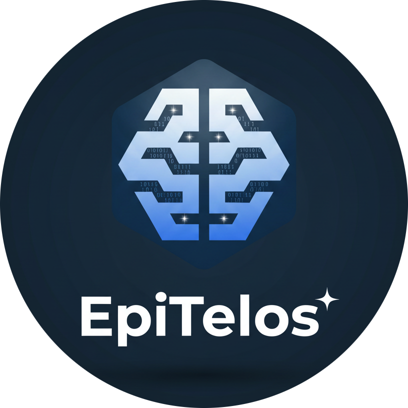
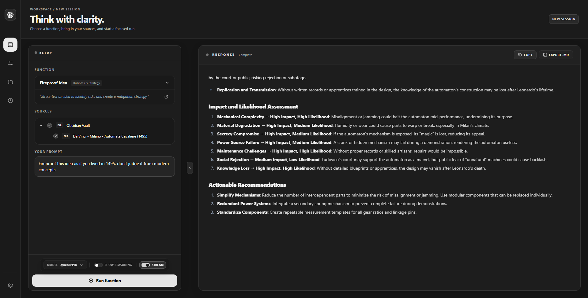
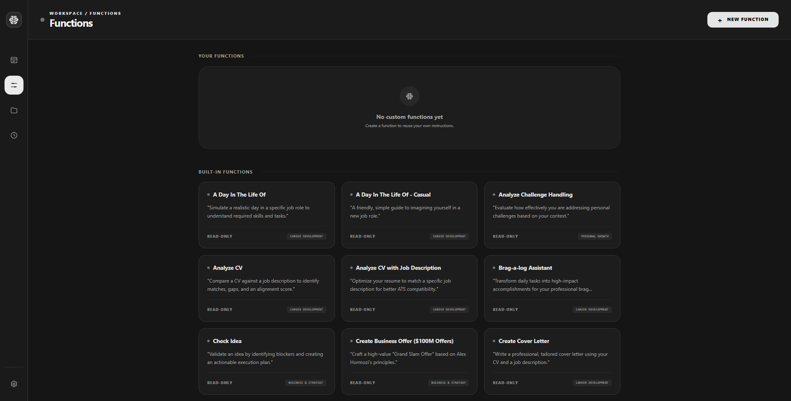
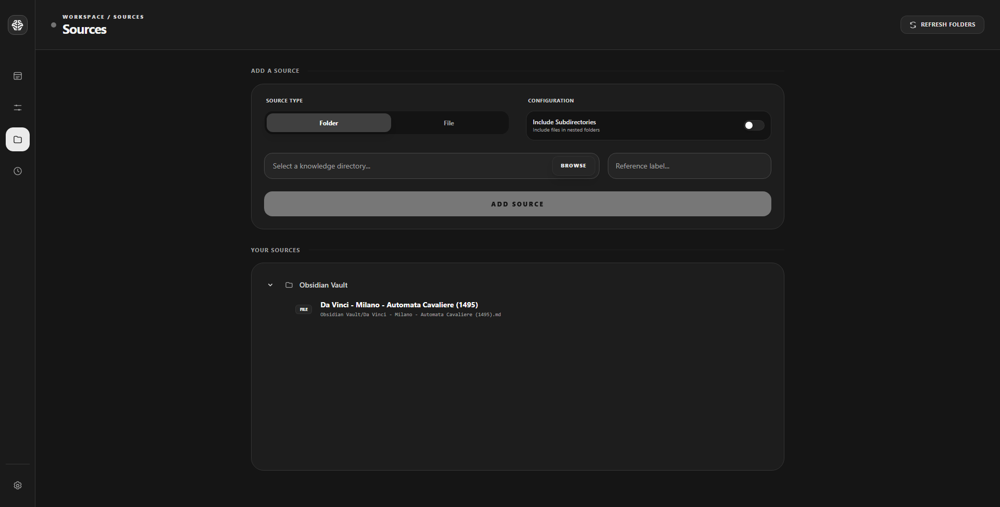
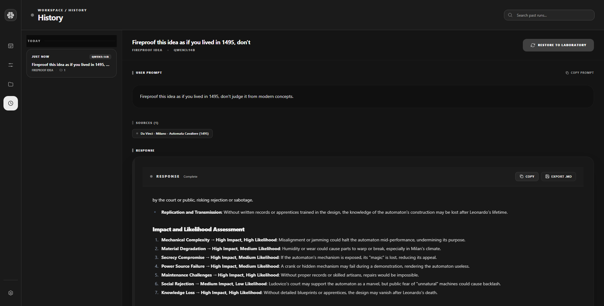
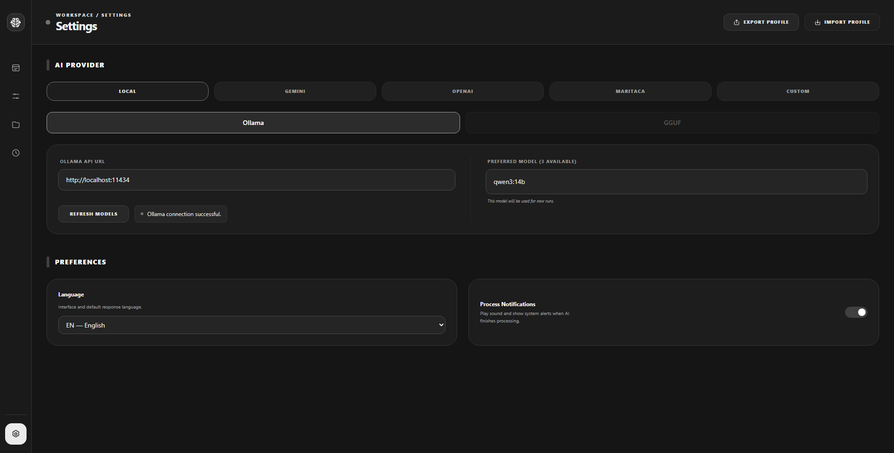

<p align="center">
  
</p>
<p align="center">
  
  
  
  
  
</p>
<h1 align="center">EpiTelos - Personal Development AI</h1>
<p align="center">EpiTelos is an AI orchestration platform designed for personal growth, strategic thinking, and self-reflection, especially for people who journal regularly.</p>

---

## Who is EpiTelos for
- **Journalers**: People who maintain daily notes, mood logs, or long-form reflections and want deeper insights into their thinking.
- **Knowledge Workers**: Professionals who maintain detailed notes and want AI assistance spotting patterns, blindspots, and hidden connections.
- **Privacy-Conscious Thinkers**: Anyone seeking a private, local-first AI thinking partner with offline model execution rather than sending personal reflections to cloud chatbots.

---

## 🧭 The Core Pillars

| Pillar | Description |
| :--- | :--- |
| **Clarity** | AI reveals recurring patterns, cognitive contradictions, and actionable insights hidden in your own notes. |
| **Privacy First** | Hardware-encrypted OS Keychain storage for API keys, with complete offline local model execution (Ollama & GGUF). |
| **Intelligence Orchestration** | Over 50 specialized system prompt architectures targeted at strategic outcomes (e.g., "Find Blindspots", "Fireproof Idea"). |
| **Contextual Awareness** | AI reasoning is grounded in your actual files and folder hierarchies, not generic pre-training data. |

---

## Screenshots

| <p align="center"></p> |
| :--- |

|  |  |
| :---: | :---: |
| **Function Manager** | **Knowledge Context** |
|  |  |
| **Session History** | **Configuration** |

---

## 📖 Component Documentation

### 1. Workspace (The Command Center)
The **Workspace** is your primary thinking environment where prompts meet knowledge context.

- **Intelligence Selector**: Search and select from 50 built-in professional prompts or your own custom intelligence functions.
- **Context Tree**: A hierarchical file browser with granular checkboxes to select specific files or entire directory trees as the AI's short-term memory.
- **Interactive Execution Controls**:
    - **Reasoning Toggle**: Dedicated support for chain-of-thought models (such as DeepSeek R1 and QwQ) with collapsible, animated `<think>` blocks.
    - **Stream Toggle**: Real-time token streaming to observe the AI's generation as it develops.
    - **Your Prompt**: Add focused instructions or one-off questions to steer the active run.
    - **Model Memory**: Remembers your preferred model for each provider and auto-selects it when switching.
- **Response Terminal**:
    - **Live Markdown Rendering**: Formats responses with full GFM tables, syntax-highlighted code blocks, and lists.
    - **Mermaid Visualizations**: Automatically renders interactive architectural diagrams, flowcharts, and mindmaps directly within responses.
    - **Persistence & Export**: Copy formatted text with one click or export any output to a timestamped `.md` file.

### 2. Functions (Intelligence Library)
Manages the **System Prompts** that define the AI's cognitive frameworks and areas of expertise.

- **50 Built-in Architectures**: A curated collection of reflection, strategy, interpersonal, and cognitive prompt architectures (Read-Only).
- **Custom Functions**: Build proprietary functions by defining a custom system prompt, description, and classification.
- **Core View Inspection**: Click any card (built-in or custom) to open a monospaced inspection modal showing the exact instructions given to the model.
- **Categorization**: Filter and organize prompts by categories such as *Business & Strategy*, *Personal Growth*, *Career Development*, *Interpersonal*, and *Project Management*.

### 3. Sources (Knowledge Manager)
Curates the documents, journals, and directories that the AI is permitted to examine.

- **Flexible Ingestion**: Add individual files or entire folders using native OS file pickers or drag-and-drop.
- **Recursive Control**: Optionally include nested subdirectories when importing folders.
- **Visibility Toggles**: Temporarily hide specific sources from the active Workspace without deleting them from your database.
- **Local Persistence**: Knowledge source paths are stored locally on your machine and never synced to external cloud servers.

### 4. History (Session Archives)
A centralized timeline of every run, reflection, and AI interaction.

- **Date Grouping**: Automatically organizes sessions into chronological sections (*Today*, *Yesterday*, *This Week*, *This Month*, or older).
- **Omni Search**: Search and filter past interactions by prompt text, response content, model, or function name.
- **Context Provenance**: Clickable context chips show the exact knowledge sources used for any past session and open an instant inspection view.
- **1-Click Workspace Restore**: Click **Restore to Laboratory** to reload the session's prompt, function, model, and context back into the active Workspace.
- **Reasoning Preservation**: Preserves the complete chain-of-thought reasoning trace alongside the assistant's final response.
- **Keyboard Navigation**: Browse past sessions with arrow keys, restore with `Enter`, delete with `Delete`, and dismiss with `Esc`.

### 5. Settings (Global Configuration)
Configure AI providers, inference backends, and user preferences.

- **Provider Management**:
    - **Local (Default)**:
        - **Ollama**: Connect to a local Ollama instance (`http://localhost:11434`) with model detection, streaming, and reasoning support.
        - **GGUF (Desktop)**: Run local `.gguf` model files directly on Windows with llama.cpp and GPU acceleration.
    - **Cloud Providers**:
        - **Google Gemini**: Built on the official `@google/genai` SDK.
        - **OpenAI**: Native support for standard OpenAI chat and reasoning models.
        - **Maritaca AI**: Specialized reasoning models tailored for Brazilian Portuguese.
        - **Custom Endpoints**: Compatible with any OpenAI-compatible API base URL (vLLM, LM Studio, OpenRouter, LocalAI).
- **Bilingual Interface**: Select **English** or **Brazilian Portuguese (`pt-BR`)** for the interface and default generation language (overrideable in prompts).
- **Interface Preferences**: Toggle completion sounds and system notifications.
- **Profile Portability**: Export your entire setup (settings and context registry) to JSON and import it onto another machine.
- **Secure Key Storage**: API keys on the desktop build are stored securely in the operating system's credential keychain.

---

### Local GGUF models (Windows desktop)

In Settings, choose **Local > GGUF**, add one or more downloaded `.gguf` files, select a model, and click **Load Model**. EpiTelos starts a bundled llama.cpp server locally and loads one model at a time. Model selectors show the file name while keeping its full path internally. No API key is required; supply your own model file. The browser build cannot run local GGUF models.

The default context window is 8,192 tokens; Settings also offers 4,096 and 16,384. If selected sources and instructions exceed the window, deselect some sources or increase **Context window (tokens)**. A larger window uses more memory and reloads the model.

The Windows desktop bundle includes llama.cpp `b11163` CPU, CUDA 12.4, and Vulkan x64 runtimes. Automatic mode tries CUDA when an NVIDIA GPU is detected, Vulkan for another detected GPU, and CPU otherwise. A GPU requires a compatible driver and enough memory; if loading fails, choose **CPU** in Settings and select **Load Model**. Some GGUF models may need chat templates or more memory than the machine provides. Loading status and failures appear in Settings; detailed startup logs are written to the app log directory as `local-gguf.log`. When running a locally built executable directly, keep the prepared runtimes in `src-tauri/resources/local_gguf/`.

The runtimes are downloaded with SHA-256 verification during Windows desktop packaging via `scripts/prepare-llama-runtimes.ps1`. llama.cpp is MIT licensed; its license is bundled in `src-tauri/resources/LLAMA_CPP_LICENSE.txt`. CUDA redistributable libraries come from the pinned llama.cpp release and remain subject to NVIDIA's applicable redistribution terms. Users supply their own model files and are responsible for their model licenses.

---

## 🚀 Technical Setup & Development

### Web Development
1. **Install dependencies**:
   ```bash
   npm install
   ```
2. **Start development server**:
   ```bash
   npm run dev
   ```
3. **Build web assets**:
   ```bash
   npm run build
   ```
4. **Preview production build**:
   ```bash
   npm run preview
   ```

### Desktop Deployment (Tauri)
1. **Prerequisites**: [Node.js](https://nodejs.org/) (v18+) & [Rust](https://www.rust-lang.org/) (cargo).
2. **Run Tauri in development**:
   ```bash
   npm run tauri dev
   ```
3. **Package desktop application** (Generates standalone `.exe` installer):
   ```bash
   npm run build:installer
   ```

### Adding Built-in Functions
EpiTelos includes an automated prompt discovery system:
1. Create a new folder inside `functions/<function_id>/`.
2. Add `system.md` containing the system prompt instructions.
3. Add `metadata.json` specifying `name`, `description`, and `category`.
4. Run the manifest generator:
   ```bash
   npm run generate-functions
   ```

### UI Screenshot Automation
Regenerate high-resolution screenshots for all application views at any time:
```bash
npm run capture-screenshots
```

---

## Responsible Use & Disclaimer
EpiTelos is a prototype provided "as is" for personal reflection, exploration, and experimentation. The author is not responsible or liable for any decisions, actions, outcomes, damages, losses, or consequences that result from using this software or relying on its outputs.

AI-generated content can be incomplete, inaccurate, biased, misleading, or inappropriate for your situation. Always review, verify, and critically evaluate every AI output before using it, especially when it may affect your health, relationships, finances, legal obligations, career, safety, or other important life decisions.

EpiTelos is not a substitute for professional advice, diagnosis, treatment, counseling, legal guidance, financial advice, or any other qualified professional service. If you need help with a serious, sensitive, or high-stakes matter, seek support from an appropriate qualified professional.

---

This project is inspired by the concepts of [Fabric](https://github.com/danielmiessler/Fabric) and [Telos](https://github.com/danielmiessler/Telos).
